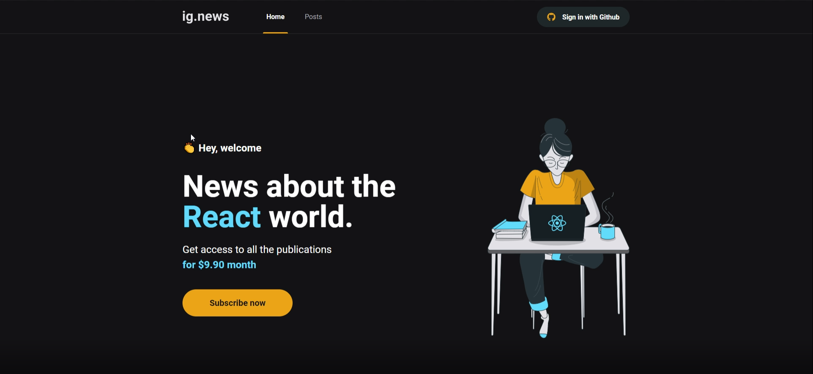

  IGNEWS - Blog de Notícias sobre Tecnologia

  <a href="#sobre">Sobre</a> &#xa0; | &#xa0;
  <a href="#tecnologias">Tecnologias</a> &#xa0; | &#xa0;
  <a href="#melhorias">Melhorias</a> &#xa0; &#xa0;
  <a href="#prints">Prints</a> &#xa0; &#xa0;

 

## :link: [Acessar Projeto](https://ig-news-joaomarinho94.vercel.app/) ##

<h2 id="sobre">:dart: Sobre</h2>

O projeto ig.news é um blog sobre notícias de tecnologia, desenvolvido com next.js em conjunto com o react.js. Onde foi desenvolvido uma página Posts para listar via SSG (static site generation) os posts cadastrados no Prismic CMS e caso o usuário não esteja logado na aplicação ou com uma assinatura cancelada, ele visualizará uma página de preview da notícia, também desenvolvida via SSG onde é gerada uma página estática para poupar requisições na api do Prismic CMS e caso queira visualizar a notícia por completo deverá se cadastrar e comprar uma assinatura válida via api do Stripe para então visualizar a página do Post completo, desenvolvida via SSR (serve side rendering) para sempre termos como validar a assinatura do usuário.

Essa aplicação foi desenvolvida no padrão Serveless apartir do next.js, evitando a construção de um backend próprio dando origem ao um novo padrão de desenvolvimento o JAMStack (JavaScript, API e Markup).

<h2 id="tecnologias">:rocket: Tecnologias</h2>

As seguintes tecnologias foram utilizadas no projeto:

- [Next.js](https://nextjs.org/)
- [Prismic CMS](https://prismic.io/)
- [Stripe](https://stripe.com/)
- [FaunaDB](https://fauna.com/)
- [Next/auth](https://next-auth.js.org/)
- [Jest](https://jestjs.io/pt-BR/)

<h2 id="melhorias">:hammer_and_wrench: Melhorias</h2>

Implementado as seguintes melhorias no projeto:

- :x: responsividade das páginas (mobile, tablets e desktop)
- :heavy_check_mark: validações adicionais

<h2 id="prints">:framed_picture: Prints da Aplicação</h2>

<h1 align="center">
    
    
    
    
    
</h1>
